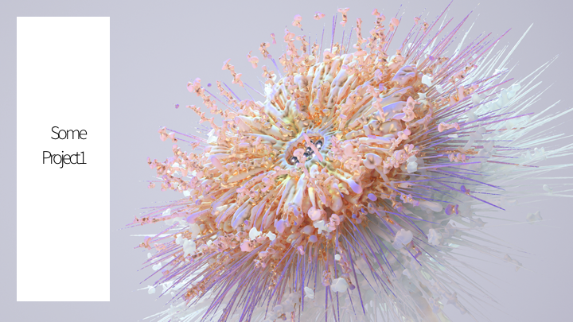
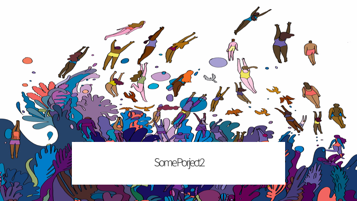
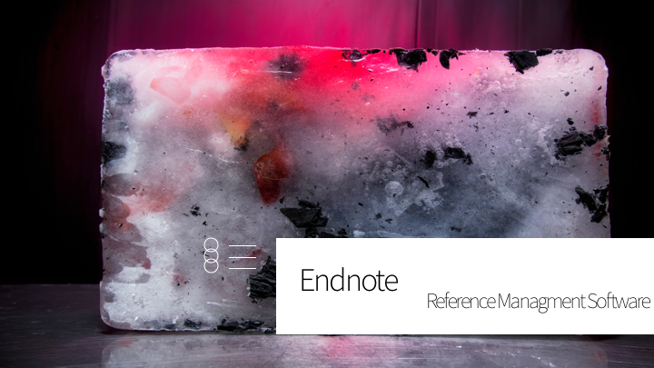

<!DOCTYPE html>
<html>
<head>
	<!-- Google Tag Manager -->

<!-- End Google Tag Manager -->
	<title>Chen Song</title>
	
	<link rel="stylesheet" type="text/css" href="css/main.css">
	<link rel="stylesheet" href="https://cdnjs.cloudflare.com/ajax/libs/animate.css/3.5.2/animate.min.css">
	<link rel="shortcut icon" type="image/png" href="image/favicon.ico"/>

	<!-- Required meta tags -->
    <meta charset="utf-8">
    <meta name="viewport" content="width=device-width, initial-scale=1, shrink-to-fit=no">
    <!-- Bootstrap CSS -->
    <link rel="stylesheet" type="text/css" href="bootstrap/css/bootstrap.css">
	<link href="https://fonts.googleapis.com/css?family=Source+Sans+Pro:200,300,300i,400,400i,700,700i" rel="stylesheet">
	<link href="css/hover.css" rel="stylesheet" media="all">
	<!--Java-->
	
	

</head>

<body>
	<!-- Google Tag Manager (noscript) -->
<noscript><iframe src="https://www.googletagmanager.com/ns.html?id=GTM-NW63PWB"
height="0" width="0" style="display:none;visibility:hidden"></iframe></noscript>

 
 
 <button type="button" class="btn btn-secondary float-right" style="background-color: white; border-color: white;">
<a href="https://www.behance.net/songchenmo328d" style="color:black;">
			Behance</a>

<a href="document/resume.pdf" style="color:black">Resume</a>
</button>

	
	
<h5 class="animated bounce">Chen Song</h5>
	 a human-centred junior UX researcher and designer backgrounded in Cognitive Neuroscience and Human Resource

	

	
	

		

			

				<a href="bhe.html" class="hvr-float">
				<figure class="figure">
  					
 	 				<figcaption class="figure-caption" >Kids Check-in App</figcaption>
				</figure>
				</a>
			

			

				<a href="login.html" class="hvr-float">
				<figure class="figure">
  					
 	 				<figcaption class="figure-caption" ><b>SIMPLE</b> Login UI</figcaption>
				</figure>
				</a>
			

			

				<a href="un.html" class="hvr-float">
					<figure class="figure">
  						<figcaption class="figure-caption"><b>UX Job</b></figcaption>
					</figure>
				</a>
			

			

				<a href="endnote.html" class="hvr-float">
					<figure class="figure">
  						
 	 					<figcaption class="figure-caption"></figcaption>
				</figure>
				</a>
			

			

				<a href="lab.html" class="hvr-float">
					<figure class="figure">
  						
 	 					<figcaption class="figure-caption"></figcaption>
					</figure>
				</a>
			

			

				<a href="un.html" class="hvr-float">
					<figure class="figure">
  						
 	 					<figcaption class="figure-caption"></figcaption>
					</figure>
			</a>
			

	
	

	
	

		

			
	

				<h3>About me</h3> 
				
Observing human beings behavior is one of my favorite thing since 8 months (my mom told me about that :-P).
				I worked as research assistant in Cognitive Neuroscience Labs since undergraduate. Wooop! 
				In my spare time, I like hiking, walking "cats", and cooking!
	
			

			

		
				<h3>Contact me</h3>
				
<b>Phone</b>: 214-685-1582

				
<b>Email</b>: <a href="mollysong@outlook.com" class="hvr-float-shadow"> mollysong@outlook.com
</a>		
			

		

	

	
		
 Designed and Coded by Chen Song (Molly)

	

</body>
</html>
